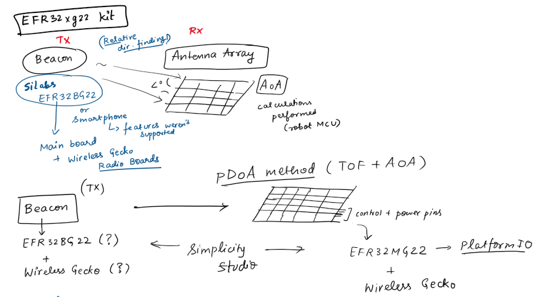

# Tinkering-Project-BLE5.1
Exploring BLE5.1 capabilities through a person-monitoring robot car system using SiLabs Thunderboard EFR32BG22 board as the beacon, EFR32MG22 as receiver MCU attached to the antenna array.

A rough workflow:

